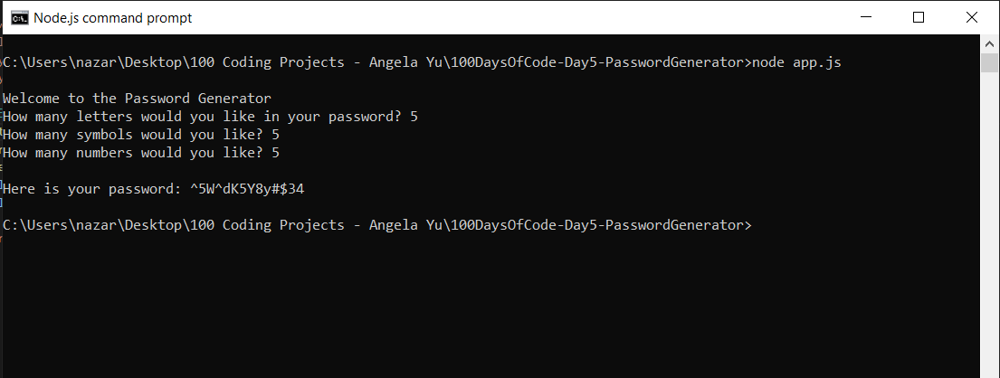

# 100 Days of Code - Day 5 - Password Generator

# Prompt

Write a program that has the following console features:

* Write "Welcome to the Password Generator"
* Ask the user how many letters they would like in their password
* letters should randomly be assigned upper or lower case
* Ask the user how many symbols would they like in their password
* Ask the user how many numbers would they like in their password
* display a new generated password for the user to copy and paste.

# Example

Welcome to the Password Generator

How many letters would you like in your password? 12
How many sumbols would you like? 2
How many numbers would you like ? 2

Here is your password: hKkC&OuKlFu2b%7G

# Screenshot of Working Solution

